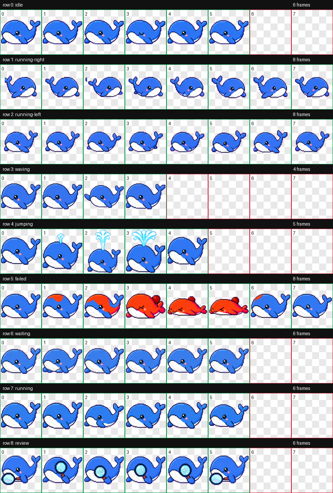

# Harness Pet

> A tiny whale that lives inside DeepSeek Harness.

**This is an unofficial community project. Not affiliated with, endorsed by, or maintained by DeepSeek. DeepSeek and related marks belong to their respective owners.**



```sh
dsh plugin --profile web add github:cakeni/harness-pet
```

[中文说明](./README.zh.md)

Harness Pet is an open-source, native DSH web plugin—not a browser extension. It renders an original pixel whale inside the Harness page and reacts to structured session signals exposed by the official client runtime.

## Features

- Nine visual states: idle, thinking, working, searching, bash, editing, waiting, error, and success.
- A QA-validated 8×9 atlas with fixed 192×208 cells: calm idle, directional drag movement, wave/click, connected water-spout success, red-hot fault/error, waiting, active work, and magnifying-glass search animations.
- A Codex Pet-style card above the whale showing the latest local user prompt, live/final Harness reply, and progress; long streams follow the newest text while remaining scrollable, and displayed text is never persisted.
- Dragging uses dedicated left/right swimming rows; clicking plays a short flipper wave without sprite overflow.
- Optional Chromium desktop-window mode keeps the pet visible in an always-on-top Document Picture-in-Picture window while the main Harness window is minimized.
- Draggable, viewport-clamped position saved in `localStorage`.
- Pet size, opacity, enable/disable, reset position, and reduced-motion controls.
- Instant, persisted interface switching between English (default), Simplified Chinese, Japanese, and Korean.
- Debug state override, automatic state cycling, and a live status badge.
- Original pixel sprites embedded directly into the client bundle, with the procedural Canvas whale retained as a fallback.
- Full cleanup for subscriptions, timers, animation frames, media listeners, and resize listeners.

## Install

Harness `0.1.0-rc.6` and `pnpm` on `PATH` are required. Installing or removing a plugin changes the host roster, so restart the `dsh web` process after one of these commands. A code-only rebuild of an existing link installation needs only a page refresh.

### npm

The package name is reserved for a future npm release. Until it is published,
use the Git or local-link installation below.

```sh
dsh plugin --profile web add harness-pet
```

### Git

```sh
dsh plugin --profile web add github:cakeni/harness-pet
```

Git dependencies run this package's `prepare` build. If pnpm blocks that build, add the exact package key printed by the CLI to the profile's `pnpm-workspace.yaml`, for example:

```yaml
allowBuilds:
  harness-pet: true
```

Then repeat the install command. The profile is normally under `$DSH_HOME/profiles/web`.

### Local development link

Run this from the repository's parent directory:

```sh
dsh plugin --profile web add link:../harness-pet
```

Build and refresh during development:

```sh
cd harness-pet
pnpm bundle
```

Do not run more than one link installation for the same profile.

## State detection

The adapter subscribes to the current `ctx.sessions` list and `SessionFace` snapshot. It also observes `ctx.connection.hostDescription`; after a connection has existed, that structured value becoming absent indicates reconnecting. It never matches translated UI text or scrapes the DOM.

Priority is: `error > success > waiting > searching/bash/editing > working > thinking > idle`.

| Pet state | Structured detection | Confidence | Failure degradation |
|---|---|---:|---|
| `idle` | No higher-priority signal | High | Remains idle |
| `thinking` | `partial` is present and no tool is running | High | Idle if the field is absent or malformed |
| `working` | `running === true`, or non-empty unknown `runningCalls` | High | Idle after all running signals clear |
| `searching` | Running tool name matches the adapter's web-tool table | Medium | Unknown tool names degrade to working |
| `bash` | Running tool name matches the adapter's shell-tool table | Medium | Unknown tool names degrade to working |
| `editing` | Running tool name matches the adapter's file-write/editor table | Medium | Unknown tool names degrade to working |
| `waiting` | Non-empty `pending`, or a queue item with `placement: 'queued'` | High | Falls through to the active lower-priority state |
| `error` | `promptError`, latest `turn-error`, `lastAgentError`, or reconnecting | High | Falls through when the structured error clears |
| `success` | Derived from a clean `running: true → false` edge for about 3 seconds | Derived | Returns to the latest real state, usually idle |

The tool-name table is intentionally isolated in [`src/adapters/deepseek-harness.ts`](./src/adapters/deepseek-harness.ts). Pre-1.0 Harness releases may rename tools; an unrecognized active tool is reported only as `working`, never fabricated as a specialized state.

## Controls

- Click the whale for a short flipper-wave interaction.
- Drag it to move it; the position is persisted locally.
- Click the gray follow-up icon to open an input. Enter submits the text to the current Harness session through its official `SessionFace.prompt(..., 'queue')` method.
- Close the conversation card with its `×` button when it gets in the way. It stays closed for the current session; use **Show Dialog** in settings to restore it. A different session opens the card again.
- Double-click, long-press, or use the gear button to open settings. Drag the settings title bar to move that panel independently of the whale.
- Choose **Language** in settings to switch all pet controls, status text, dialog prompts, and desktop-window messages immediately.
- When **Open Floating Pet** is enabled in settings, the main Harness window may be minimized while the pet remains in its independent always-on-top window. The Harness tab and browser process must remain open.
- If the pet is disabled, the gear remains at the lower-right so it can be enabled again.
- Debug State can follow Harness or force any visual state. Auto-cycle rotates through all nine states.

Both the operating-system `prefers-reduced-motion: reduce` preference and the manual Reduced Motion setting stop continuous animation while retaining the correct static state.

## Privacy

**No telemetry. Harness Pet sends no conversation data to any third party.**

The plugin makes no independent `fetch`, analytics, telemetry, cloud-sync, or third-party request. It reads the minimum structured fields needed to render the latest local user prompt and Harness reply. Displayed conversation text is never persisted. Only when you explicitly submit the follow-up input is that text delivered to the current Harness session through Harness's existing official transport. Only settings are stored in browser `localStorage`; the plugin asks for no browser permissions.

## Compatibility

| Harness client API | Status |
|---|---|
| `0.1.0-rc.6` | Targeted and type-checked against the published client contracts |
| Later `0.1.x` prereleases | Unverified; the client API is pre-1.0 and may change |
| Browser extension mode | Unsupported; this project is a native DSH plugin |
| Desktop window | Chromium 116+ Document Picture-in-Picture; unsupported browsers keep the control disabled |

All Harness coupling is kept in the adapter so API updates have one repair point.

## Development and tests

```sh
pnpm install
pnpm run typecheck
pnpm test
pnpm bundle
```

The bundle must start with a `window.__ModuleLoader__.load` registration for `harness-pet` and export `{ apply, inject }` from its factory.

Automated tests cover the state mapper and priority, success transitions and timeout, unknown-signal degradation, corrupt storage, singleton reuse, and subscription/timer cleanup. Loading inside a real Harness page, drag behavior, visual animation, SPA navigation, and long-running leak checks still require manual browser verification.

## Manual verification

After installing and restarting `dsh web` yourself:

1. Confirm `window.__DSH_BOOT__.entries` contains `harness-pet`.
2. Confirm `/plugins/harness-pet/client.js` returns HTTP 200.
3. Confirm the whale and its card render without console errors, the card shows the latest local prompt plus streaming/final reply, and every Debug State is distinct.
4. Open the gray follow-up input, send a test message, and confirm it appears in the current Harness session; also verify an admission failure keeps the draft and shows an error.
5. Test dragging, reload position persistence, enable/disable, size, opacity, and reset.
6. Enable reduced motion at OS and panel levels and confirm continuous motion stops.
7. Open Desktop Window, minimize the main Harness window, and confirm the pet stays visible; close it and confirm the pet returns to Harness.
8. Navigate between sessions and SPA routes, then refresh; confirm only one pet exists.
9. Run a real search, shell command, edit, pending interaction, successful turn, error, and reconnect where available.
10. Leave the page open for an extended session and check that subscriptions and timers do not accumulate.

## Replacing or adding artwork

The current 8×9 animation atlas is embedded into `client.js`, so the plugin performs no asset request at runtime. It uses fixed 192×208 cells and transparent unused slots; semantic effects are connected to the whale and remain inside their frame—water from the blowhole, a magnifier held by the flipper, and red-hot fault coloring. To replace or add a sprite:

1. Add authorized expression/state files under `assets/whale/`.
2. Record its source, author, and license in [`assets/whale/ATTRIBUTION.md`](./assets/whale/ATTRIBUTION.md). Unregistered assets must not be distributed.
3. Bundle the bytes into `client.js` (for example as an imported data URL) instead of fetching a remote URL at runtime.
4. Keep the procedural draw path as the fallback and verify reduced-motion behavior.

Never download or include artwork of unknown provenance.

## License

[MIT](./LICENSE)
